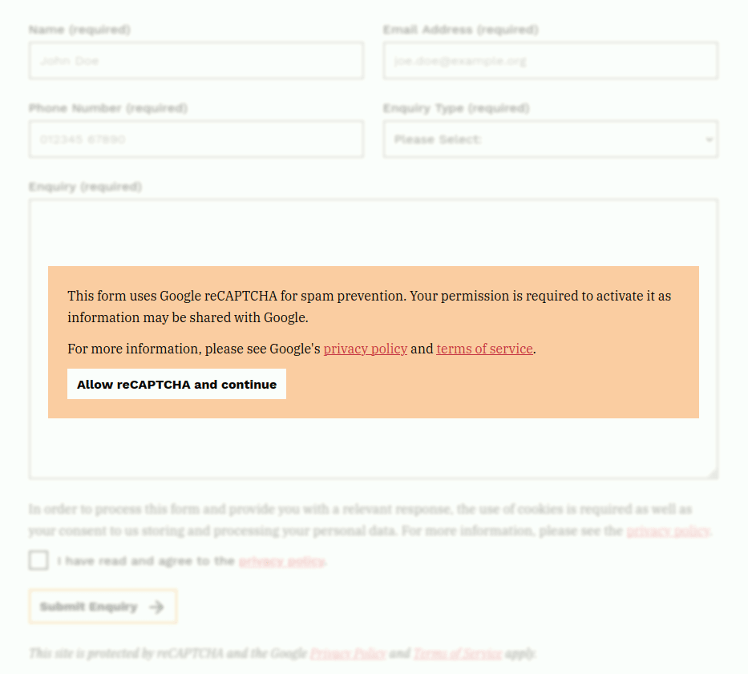

# Privacy Control

A website privacy manager which focuses on good UX, sane defaults and forgets about cookies.


## Overview

This isn't just another generic cookie banner. The aims of this library are:

- Interrupt the user as little as possible.
- Ask for consent only when it is immediately required.
- Provide simple and accessible UI.
- Focus on the third parties data is sent to rather than cookies


## Installation

```
yarn add freshleafmedia/privacy-banner
```

Once bundled add the script to the end of the `<body>` element.


## Usage

There are 4 parts:

1. Service definitions
2. Banner
3. Service scripts
4. Opt-in content


### Service Definitions

Each third party services your site uses is defined as a `<privacy-service>` element.

```html
<privacy-service
    key="google-recaptcha"
    name="Google reCAPTCHA"
    description="Used to prevent SPAM form submissions"
/>
```

```html
<privacy-service
    key="google-analytics"
    name="Google Analytics"
    description="Used to asses how the website is used by visitors"
    omnipresent
/>
```

- **key** - This is the value the service is referenced by
- **name** - The full name of the service
- **description** - What is the service being used for, why is it there
- **omnipresent** - Whether the service is required on all pages. This is for things like analytics scripts


### Banner


The banner should be added to the end of every page. If you have no 'omnipresent' privacy-services your users will never see this :tada:

```html
<privacy-banner hidden>
    <privacy-banner-message>
        This website uses cookies and third-party services which may process your personal information.
        For more information, see our <a href="/privacy">privacy policy</a>.
    </div>
    <privacy-banner-actions>
        <button class="optIn">Allow all</button>
        <button class="optOut">Reject non-essential</button>
    </div>
</privacy-banner>
```


### Service Scripts

When you have scripts which will share data with third parties they need to be replaced with `<privacy-aware-script>`.
Once consent for that service has been obtained the script will load like normal.

```html
<privacy-aware-script servicekey="google-recaptcha" src="path/to/your/script.js" async />
```

- **servicekey** - This is the key of the related service
- All other properties are passed directly to the `<script>` when it is injected. Eg `async` `defer` etc


### Opt-in content

When there is content which relies on a third party to function at all (eg YouTube embed) it should be wrapped in a `privacy-overlay`:

```html
<privacy-overlay servicekey="google-recaptcha">
    <privacy-overlay-message>
        <p>This form uses Google reCAPTCHA for spam prevention. Your permission is required to activate it as information may be shared with Google.</p>
        
        <p>For more information, please see Google's
            <a href="https://policies.google.com/privacy">privacy policy</a> and
            <a href="https://policies.google.com/terms">terms of service</a>.
        </p>
        
        <p>
            <button type="button">Allow reCAPTCHA and continue</button>
        </p>
    </privacy-overlay-message>
    
    <privacy-aware-content>
        Your content here...
    </privacy-aware-content>
</privacy-overlay>
```

- **servicekey** - This is the key of the related service




## Examples

### Form with reCATPCHA

A form using Google reCAPTCHA:

```html
<privacy-overlay servicekey="google-recaptcha">
    <privacy-overlay-message>
        <p>This form uses Google reCAPTCHA for spam prevention. Your permission is required to activate it as information may be shared with Google.</p>

        <p>For more information, please see Google's
            <a href="https://policies.google.com/privacy">privacy policy</a> and
            <a href="https://policies.google.com/terms">terms of service</a>.
        </p>

        <p>
            <button type="button">Allow reCAPTCHA and continue</button>
        </p>
    </privacy-overlay-message>

    <privacy-aware-content>
        <form>
            ...
        </form>
    </privacy-aware-content>
</privacy-overlay>

<privacy-banner hidden>
    <privacy-banner-message>
        <p>
            This website uses cookies and third-party services which may process your personal information.
            For more information, see our <a href="/privacy">privacy policy</a>.
        </p>
    </div>
    <privacy-banner-actions>
        <button class="optIn">Allow all</button>
        <button class="optOut">Reject non-essential</button>
    </div>
</privacy-banner>

<privacy-service
    key="google-recaptcha"
    name="Google reCAPTCHA"
    description="Used to prevent SPAM form submissions"
/>

<privacy-aware-script servicekey="google-recaptcha" src="path/to/recaptcha.js" />
```

### Google Analytics

A form using Google reCAPTCHA:

```html
<privacy-banner hidden>
    <privacy-banner-message>
        <p>
            This website uses cookies and third-party services which may process your personal information.
            For more information, see our <a href="/privacy">privacy policy</a>.
        </p>
    </div>
    <privacy-banner-actions>
        <button class="optIn">Allow all</button>
        <button class="optOut">Reject non-essential</button>
    </div>
</privacy-banner>


<privacy-service
    key="google-analytics"
    name="Google Analytics"
    description="Used to asses how the website is used by visitors"
    omnipresent="true"
/>

<script>
    var _gaq = _gaq || [];
    _gaq.push(['_setAccount', 'UA-XXXXXXX-X']);
    _gaq.push(['_trackPageview']);
</script>

<privacy-aware-script servicekey="google-analytics" src="https://ssl.google-analytics.com/ga.js" />
```


## Styles

You may edit the text content and style all the elements however you wish.
The [included styles](src/styles.scss), are intentionally left plain and designed to be a good starting point.


## How it works

The `<privacy-banner>` element acts as the 'source of truth' of which services there are and if they are enabled.

Whenever a service is enabled, either via the banner or an overlay, events are fired. These events are listened for by all
elements which can be affected. They then adjust their state accordingly.


## License

See [LICENSE](LICENSE)
